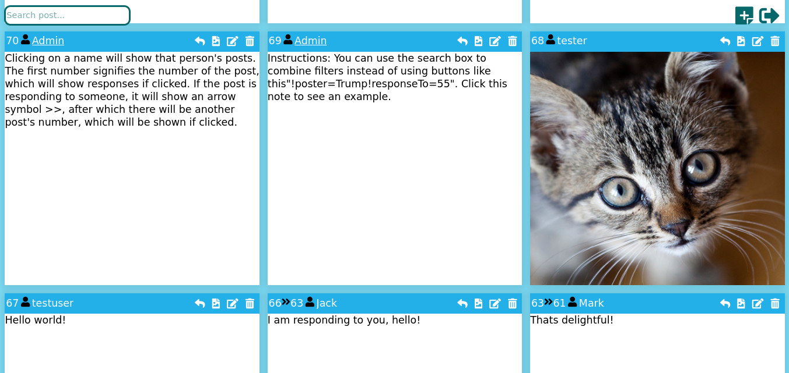

# Notewall
Site for posting messages 


[]()


## Git Commands

**Cloning the repository**

```` Git
$ git clone https://github.com/cyroxin/notewall.git
```` 

**Synchronizing changes**

```` Git
$ git pull
$ git commit -a -m "Synchronizing"
$ git push
```` 


## Setup

  1. Create a **.env** file in the the repo folder with the following content:
```` conf
DB_HOST=mysql.databaseunlimited.com
DB_USER=myusername
DB_PASS=mypassword
DB_NAME=mydatabasename
production=false
````

2. Create certificates for https and folders for hosting files by writing the following commands into the terminal:
```` batch
$ cd /location/to/your/repo/folder/
$ sudo openssl genrsa -out ssl-key.pem 2048
$ sudo openssl req -new -key ssl-key.pem -out certrequest.csr
$ sudo openssl x509 -req -in certrequest.csr -signkey ssl-key.pem -out ssl-cert.pem
$ mkdir thumbnails
$ mkdir uploads
```` 

3. Open ``projectfolder/info/Dbfile.txt`` and copy the content into your own local database defined earlier and run it.

4. Install nodejs

5. While in the project folder, run ``node app.js`` and open https://localhost:8000/ in your browser. If you receive any errors in this phase, it can be due to incompatible node_modules with your specific system. You can try removing the whole folder and reinstalling them. Commands:``rm -rf node_modules`` and ``npm install i``
 

## Q&A

**I want to move the site into an actual server instead of localhost in a way that it will use the server's own proxy configuration.**

In your .env file, change the production option to true. It should now look like this: ``production=true``. Please note that after doing so, all requests will be prefixed with ``/app`` in [request.js](public_html/js/request.js), which you can change from the url variable.

**In a server, I need to use a prefix in the url after the domain name.**

If you wish to reroute a request "https://example.com/" to "https://example.com/app". You can either route all requests with a prefix in your server's config **or** you may add the following new line to your .env file ``PROXY_PASS=/app``. Your .env file should now look like this:

```` conf
DB_HOST=mysql.databaseunlimited.com
DB_USER=myusername
DB_PASS=mypassword
DB_NAME=mydatabasename
production=true
PROXY_PASS=/app
````

To inform the clients of the prefix, you can change [request.js](public_html/js/request.js)'s request url. Currently, the default for production servers is the prefix of ``/app``.
